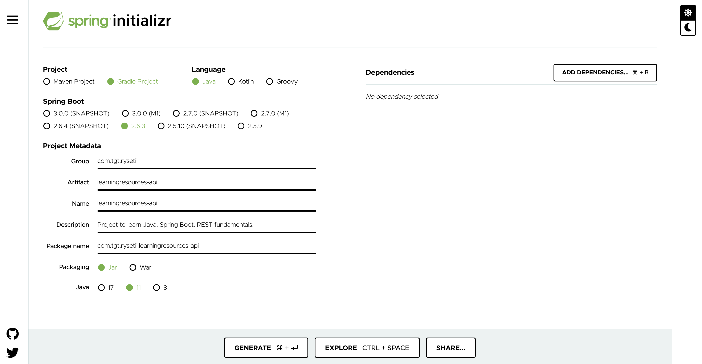

# Activity Goal

Create your first Spring Boot app

# Activity Details

1. Navigate to https://start.spring.io/ .
2. Provide details as given below 
3. Generate the folder, download, unzip and open in Intellij.
4. Build the code and explore the files created.
5. In terminal run command git init. This should create an empty `.git` folder.
6. In https://git.target.com - Create new git repository under your own org with the name `learningresources-api`.
7. Copy the git repo link and then run command from terminal `git remote add origin git@git.target.com:<Org name>/learningresources-api.git`
8. Create a new git branch with command `git checkout -b "1-HelloWorld"`
9. Run command `git add .` 
10. Commit your changes using `git commit -m "<your commit message>"`
10. Run command `git push origin "1-Hello-World"`

# Activities to explore
1. Understand the folder structure.
2. Look at the structure of the class LearningresourcesapiApplication.
3. Add a line to print "Hello world".
4. Build your code  and locate where the compiled code is stored.
5. Understand the difference between compiled code and source code.
6. Understand the main method and its relevance.
7. Understand the different git commands used.